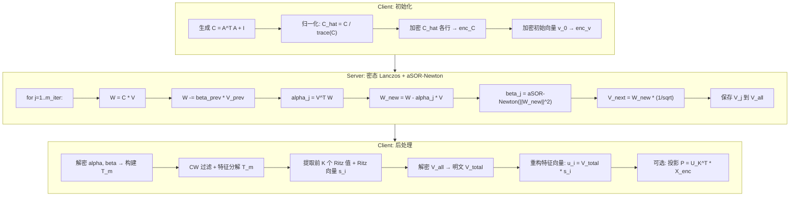

# aSOR-Newton 加速 + 完整 FHE-PCA 实施方案

## 一、aSOR 核心原理与改造思路

### 1.1 论文核心思想

aSOR 对迭代过程 x_{n+1} = f(x_n) 引入自适应松弛因子 k_i，将迭代变为 x_{n+1} = f(k_i * x_n)。每步的 k_i 预先离线计算，选取使输出区间收缩最快的最优值。关键优势：在 CKKS 中，乘以常数 k_i 可通过 scale 调整实现，几乎零深度消耗。

### 1.2 对 Newton 1/sqrt(x) 的改造

当前 Newton 迭代（[newton_inv_sqrt.cpp](src/newton_inv_sqrt.cpp)）：

```
y_{n+1} = y_n * (3 - x * y_n^2) / 2
```

对应 Algorithm 5 (m=2)，引入中间变量 z = sqrt(x) * y，迭代函数为 f(z) = z*(3-z^2)/2。aSOR 改造后：

```
y'_i = k_i * y_i          （松弛缩放）
y_{i+1} = y'_i * (3 - x * y'_i^2) / 2
```

**零成本 k_i 吸收技巧**：将 k_{i+1} 吸收到当前迭代的 0.5 常数中：
- 第一次迭代：将 k_1 吸收进初始猜测，加密 `k_1 * initial_guess` 代替 `initial_guess`
- 中间迭代：将 `multiply_plain(0.5)` 替换为 `multiply_plain(k_{i+1} / 2.0)`
- 最后一次迭代：正常乘以 0.5

这样 aSOR 不增加任何额外乘法深度，单次迭代深度不变（~3-4 层），但迭代次数从 n 降至约 n/2。

### 1.3 松弛因子预计算

对 f(z) = z*(3-z^2)/2，最优 k_i 满足 f(k_i * epsilon_i) = f(k_i)，解析解为：

```
k_i = sqrt(3 / (1 + epsilon_i + epsilon_i^2))
```

其中 epsilon_i 为第 i 步的输入下界，epsilon_{i+1} = f(k_i) = k_i*(3-k_i^2)/2。初始 epsilon_1 = sqrt(epsilon_x) 其中 epsilon_x 是归一化后输入 x 的下界。

### 1.4 预期深度节省

| 配置 | 迭代次数 | 深度消耗 |
|------|---------|---------|
| 当前 Newton (3次) | 3 | ~12 层 |
| aSOR Newton (同精度) | 2 | ~8 层 |
| **节省** | **-1** | **~4 层** |

节省的 4 层深度可支持 m_iter=2（从当前的 m_iter=1），使 Krylov 子空间维度翻倍，Ritz 值精度显著提升。

---

## 二、完整 FHE-PCA 流水线设计

### 2.1 当前系统缺失项

- 只提取特征值，**无特征向量**
- 无数据投影（PCA 的核心输出）
- 无输入归一化（Newton 收敛性依赖输入范围）
- m_iter=1 时 Krylov 子空间太小，特征值近似精度有限

### 2.2 完整流水线架构



### 2.3 关键改动点

**Server 侧**（[server.h](src/server.h), [server.cpp](src/server.cpp)）：
- `LanczosResult` 新增 `V_all` 字段存储所有基向量密文
- `lanczosIteration()` 每步将 V_j 追加到 `V_all`
- Newton 调用改为 aSOR 版本

**Newton 模块**（[newton_inv_sqrt.h](src/newton_inv_sqrt.h), [newton_inv_sqrt.cpp](src/newton_inv_sqrt.cpp)）：
- 新增 `computeWithASOR()` 方法，接受预计算的松弛因子数组
- 新增静态方法 `precomputeRelaxationFactors(epsilon, alpha)` 离线计算 k_i

**Client 侧**（[client.h](src/client.h), [client.cpp](src/client.cpp)）：
- 新增输入归一化：`C_hat = C / trace(C)` 使特征值 ∈ (0, 1]
- 新增 `reconstructEigenvectors()` 方法：解密 V_all，乘以 Ritz 向量还原特征向量
- 新增 `decryptLanczosVectors()` 方法

**主程序**（[main.cpp](src/main.cpp)）：
- 完整 PCA 流程：归一化 → 加密 → Lanczos → 特征值 + 特征向量 → 验证
- 性能计时（加密时间、Server 计算时间、解密时间）
- 正确性验证：特征值相对误差 + 特征向量余弦相似度

---

## 三、新增文件

### 3.1 `src/asor.h` — aSOR 松弛因子预计算

```cpp
struct ASORParams {
    std::vector<double> k_factors;  // 松弛因子序列
    double epsilon_init;             // 初始输入下界
    int iterations;                  // aSOR 迭代次数
};

// 对 f(z) = z*(3-z^2)/2 预计算松弛因子
ASORParams precomputeInvSqrtASOR(double epsilon, double alpha);
```

核心逻辑约 40 行：循环计算 `k_i = sqrt(3.0 / (1 + eps + eps*eps))`，更新 `eps = k*(3-k*k)/2`，直到 `1 - eps < pow(2, -alpha)`。

---

## 四、输入归一化策略

当前 `C = A^T A + I` 的特征值范围约 [1, 25]（d=10）。Newton 1/sqrt(x) 要求输入在可控范围内。

**归一化方案**：
- `C_hat = C / trace(C)`，使特征值之和为 1，最大特征值 < 1
- Newton 输入 `||W||^2` 也会被相应缩放到 [0, 1] 区间
- aSOR 的 epsilon_1 = sqrt(lambda_min / lambda_max) 可从 `eigenvalueMagnitudeGuess()` 粗估
- 反归一化：最终特征值乘回 trace(C)

---

## 五、测试与验证方案

### 5.1 正确性测试

| 测试项 | 方法 | 通过标准 |
|--------|------|---------|
| aSOR Newton 精度 | 对 x=0.1,0.5,1,2,5 加密后调用，与明文 1/sqrt(x) 对比 | 相对误差 < 1% |
| Lanczos 特征值 | 与 Eigen SelfAdjointEigenSolver 对比 | 前 K 个相对误差 < 5% |
| 特征向量 | 与真实特征向量计算余弦相似度 | cos > 0.9 |
| 端到端 PCA | 投影重建误差 | 优于随机基准 |

### 5.2 性能基准

- d=10, K=2, m_iter=1..3: 计时 Server 侧计算
- 对比 Newton vs aSOR-Newton 的迭代次数和总耗时
- 记录每步 Lanczos 剩余模链深度

### 5.3 测试参数

```
小规模: d=10, p=1, K=2, m_iter=2, newton_iters=2(aSOR) 或 3(标准)
中规模: d=30, p=1, K=3, m_iter=3
```

---

## 六、文件改动总览

| 文件 | 改动 | 估计行数 |
|------|------|---------|
| `src/asor.h` (新增) | aSOR 松弛因子预计算 | ~60 |
| `src/newton_inv_sqrt.h` | 新增 `computeWithASOR()` 声明 | +10 |
| `src/newton_inv_sqrt.cpp` | 实现 aSOR Newton 迭代 | +50 |
| `src/server.h` | LanczosResult 添加 V_all; 新增参数 | +10 |
| `src/server.cpp` | 存储 V_all; 调用 aSOR Newton | +20 |
| `src/client.h` | 新增归一化/反归一化、特征向量重构 | +15 |
| `src/client.cpp` | 实现归一化、V_all 解密、特征向量重构 | +80 |
| `src/main.cpp` | 完整 PCA 流程 + 计时 + 验证 | 重写 ~150 |
